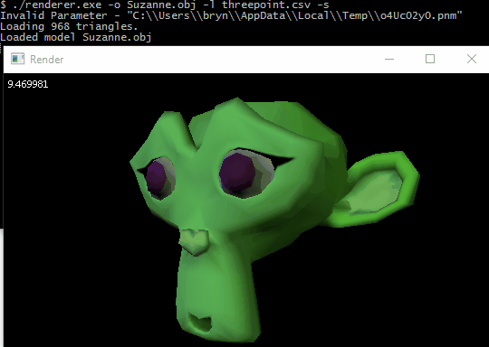

# Software rasteriser

An implementation of the rasterisation algorithm for drawing 3D triangles using OpenGL-imitation maths.

This is a self-learning project intended to teach me how an Open-GL style renderer works behind the scenes. It is fairly closely based on the approach described at [Scratchapixel](https://www.scratchapixel.com/lessons/3d-basic-rendering/rasterization-practical-implementation/overview-rasterization-algorithm), but with some modifications to use the OpenGL perspective projection matrix. A log of development can be found [here](http://canonicalmomentum.tumblr.com/tagged/building-my-own-rasteriser/chrono).

## Example output

## Third party code

Included in repository:
- the [CImg](http://cimg.eu/) library. The license is contained in the vendor/cimg/ folder along with the header file.
- [tinyobjloader](https://github.com/syoyo/tinyobjloader) by syoyo. The license is written at the top of the header file.

Needed for compilation:
- [OpenGL Mathematics (GLM)](https://github.com/g-truc/glm), which should be installed using [Conan](https://www.conan.io/) as described below.
- [Templatized C++ Command Line Parser Library (TCLAP)](http://tclap.sourceforge.net/), which should be installed using Conan.
- [text-csv](https://github.com/roman-kashitsyn/text-csv), which should be installed using Conan.
- [CMake](https://cmake.org/).

Needed to run:
- [ImageMagick](http://imagemagick.org/script/index.php) or [GraphicsMagick](http://imagemagick.org/script/index.php) to allow CImg to output PNG files.

## Building

1. Create a `build` folder inside the project folder.
2. In the build folder, run `conan install .. --build TCLAP` to install GLM, TCLAP and text-csv via Conan, and produce a CMake file.
3. Run `cmake ..` to produce build files appropriate to your build system (e.g. a makefile for GCC).
4. Compile according to your system (e.g. with `make` for gcc, or `ming32-make` for MinGW-GCC).

## Use
Run the executable from the command line. Flags available:
- `-h`/`--help`: display command line options and exit

Loading files:
- `-o`/`--obj`: render the model in the specified Wavefront .obj file (otherwise renders a square)
- `-l`/`--lights`: (required) specify CSV file containing a list of directional lights in the format `dir_x,dir_y,dir_z,intensity,red,green,blue` (all interpreted as floating point numbers)

Render settings:
- `-x`/`--width`: width of the output image (pixels)
- `-y`/`--height`: height of the output image (pixels)
- `-s`/`--spin`: instead of outputting the frame and depth buffers as images, display a window with the model rotating at 1 radian/sec about the y axis
- `-f`/`--flat`: disable smooth shading, and use calculated face normals instead of given vertex normals
- `--wind-clockwise`: specify that triangles should be interpreted to use a clockwise rather than anticlockwise winding order

Transform model:
- `--scale`: scale the model uniformly by a factor
- `--dx`, `--dy`, `--dz`: displace model in X, Y and Z directions by distance
- `--rx`, `--ry`, `--rz`: rotate model according to YXZ [Tait-Bryan angles](https://en.wikipedia.org/wiki/Euler_angles#Tait.E2.80.93Bryan_angles) in radians

If `-s` is not set, two images will be output. `frame.png` is the rendered image, and `depth.png` is the depth buffer.